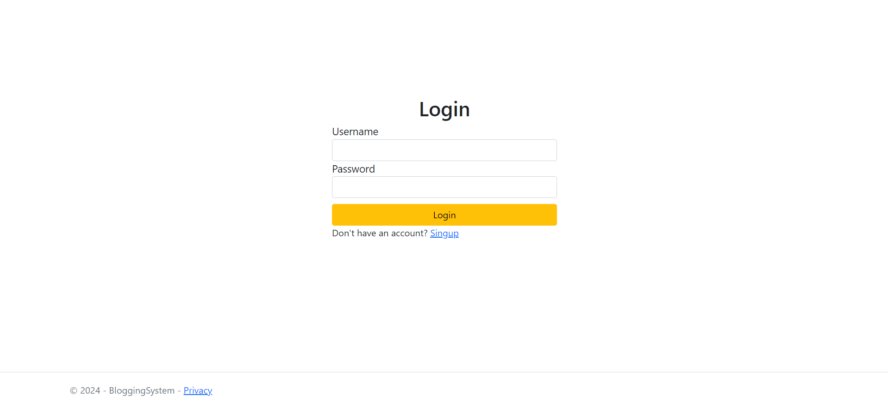
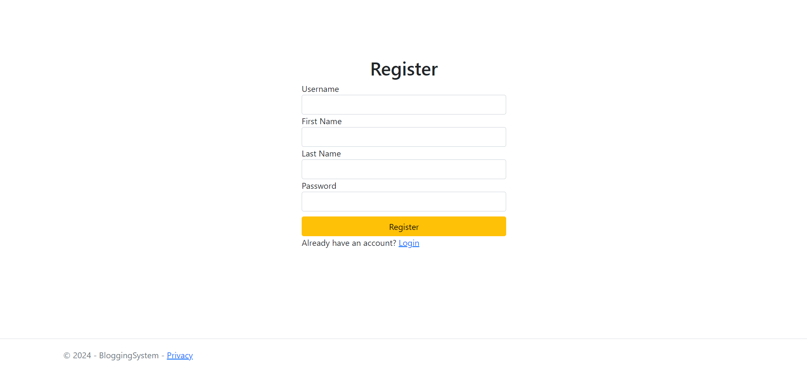
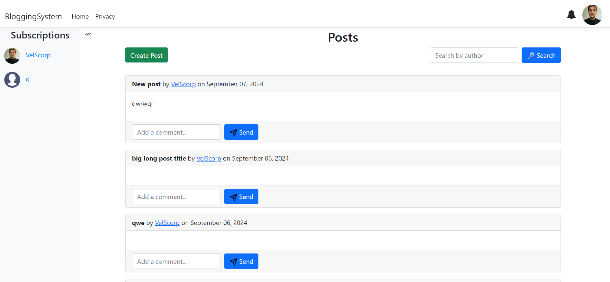
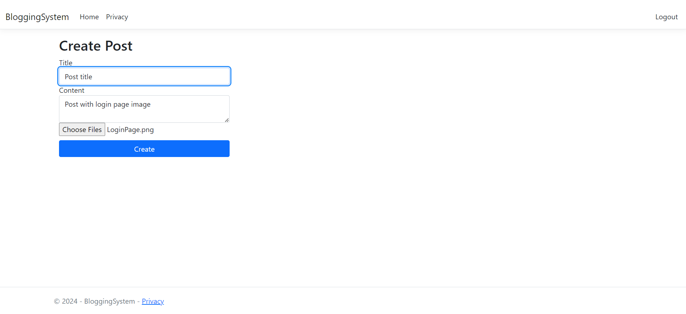

# Blogging System

The Blogging System is a modern web application for managing blog posts, built using various cutting-edge technologies. This project leverages ASP.NET Core MVC for the web application framework, MongoDB for document storage, Elasticsearch and Kibana for search and analytics, Redis for caching, Ceph S3 for scalable object storage, and Docker Compose for container orchestration.

## Features

- User Authentication & Authorization: Secure login and registration for users.
- Create/Edit/Delete Blog Posts: Full CRUD (Create, Read, Update, Delete) functionality for blog posts.
- View Blog Posts: Display all blog posts, with options to search by author.
- Commenting System: Users can leave comments on blog posts.
- Search Functionality: Fast and efficient search capabilities for blog posts using Elasticsearch.
- Analytics & Monitoring: Real-time monitoring and visualization of application data with Kibana.
- Caching: Improved performance through Redis caching.
- Media Storage: Scalable object storage for media files using Ceph S3.

## Screenshots

### Login page


### Register page


### Posts main page


### Create post page


## Technologies Used

- ASP.NET Core MVC: Provides the framework for building the web application, handling HTTP requests, and rendering views.
- MongoDB: A NoSQL database used to store blog posts, comments, and users in a flexible, document-oriented format.
- Elasticsearch: Used for search by post author and indexing of blog posts, enabling fast and efficient search capabilities.
- Kibana: Provides visualization and analysis tools for monitoring and exploring data indexed in Elasticsearch.
- Redis: A fast, in-memory data store used for caching user sessions to improve performance.
- Ceph S3: An object storage service compatible with the S3 API, used for storing and retrieving media files, such as images and attachments.
- Docker Compose: Allows you to define and manage multi-container Docker applications, making it easier to set up and run the application stack.

## Docker-Compose Installation

If you prefer to run the application in a Docker containers, follow these steps:

1. Clone the repository:

```bash
git clone https://github.com/VelSkorp/BloggingSystem.git
```

2. Navigate to the project directory:

```bash
cd BloggingSystem
```

3. Run `RunDockerCompose.sh` file to launch the application in docker containers using docker-compose.
3. Run `StopDockerCompose.sh` to delete and clean up the application data.

## Usage

Once the application is running, you can interact with the Blogging System through the web interface.

### Access the Application

- Open your browser and navigate to `http://localhost:8080` or `https://localhost:8081` using SSL connection.
- Register a new account or log in with existing credentials.

### Creating a New Blog Post

- Navigate to the "Create New Post" page from the main menu.
- Fill in the title, content, and upload images.
- Save the post to publish it.

### Commenting on Posts

- View a blog post and leave a comment at the bottom of the post.
- Comments are visible to all users.

### Access the Ceph S3 storage

- Open your browser and navigate to `https://localhost:8443` using SSL connection.
- Use the username `admin` and passwrod `admin` to access the Ceph S3 dashboard.

### Access the Kibana

- Open your browser and navigate to `https://localhost:5601` using SSL connection.
- Use the username `elastic` and passwrod `development` to access the kibana.

### Access the Elasticsearch API

- Use `https://localhost:9200` Url on host machine or `https://elasticsearch:9200` Url inside docker containers in a default docker-compose network.
- Use the username `elastic` and passwrod `development` to access the `elastic` superuser.
- Use the username `kibana_system` and passwrod `development` to access the `kibana_system` user used to connect kibana to elasticsearch.
- It is also possible to access other elasticsearch built-in users by changing the user password in the `/Docker/elasticsearch/configure.sh` file using the `docker-compose exec` command.

## Contributing

Contributions are welcome! Please submit issues or pull requests with any improvements, bug fixes, or new features.

## License

This project is licensed under the MIT License - see the [LICENSE](LICENSE) file for details.