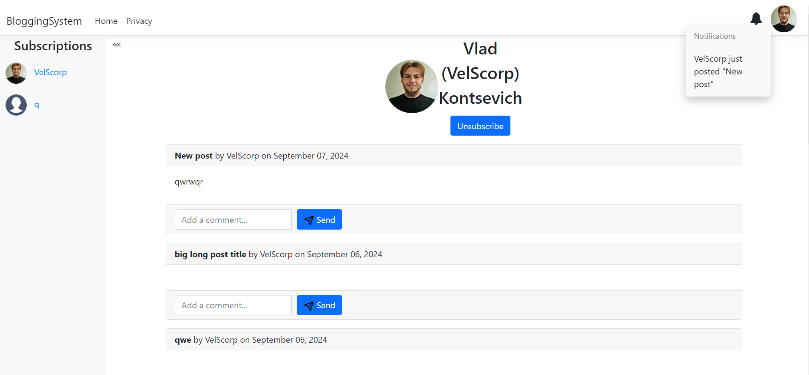
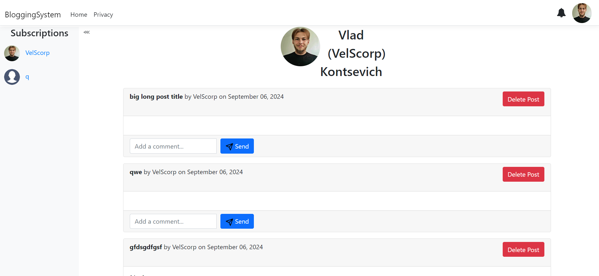

# Blogging System

The Blogging System is a modern web application for managing blog posts, built using various cutting-edge technologies. This project leverages ASP.NET Core MVC for the web application framework, MongoDB for document storage, Elasticsearch and Kibana for search and analytics, Redis for caching, Ceph S3 for scalable object storage, and Docker Compose for container orchestration.

## Features

- **User Authentication**: Secure login and registration.
- **CRUD for Blog Posts**: Create, update, delete, and view blog posts effortlessly.
- **View Blog Posts**: Display all published blog posts in a clean and organized format, allowing users to browse through the articles effortlessly. A search option makes it easy to find content by author.
- **View Author Profile**: Showcase all posts written by a specific author. The profile includes a list of the author's published content and their details.
-  **User Profile Management**: Users can view and edit their own profiles, and manage their blog posts directly from their dashboard.
- **Commenting System**: Engage with content through an integrated commenting system. Users can leave comments on individual blog posts to encourage discussions.
- **Search by Author**: Powered by Elasticsearch, this functionality allows fast, efficient searches of blog posts based on the author. Users can find relevant content quickly and easily.
- **Real-time Analytics**: Visualize and monitor data with Kibana.
- **Caching with Redis**: Boost performance by using Redis to cache frequently accessed data. This significantly improves load times and scalability for high-traffic scenarios.
- **Media Storage**: Upload images and files with scalable Ceph S3 storage.
- **Subscription System**: Users can subscribe to their favorite authors to receive updates whenever new posts are published, ensuring they never miss out on content.
- **Notification System**: A built-in notification system sends alerts to users for important updates like new blog posts, comments on their articles, or replies to their comments.

## Screenshots

### Login page

### Register page

### Posts main page

### Create post page

### Author page

### Profile page

## Technologies Used

- ASP.NET Core MVC: Provides the framework for building the web application, handling HTTP requests, and rendering views.
- MongoDB: A NoSQL database used to store blog posts, comments, and users in a flexible, document-oriented format.
- Elasticsearch: Used for search by post author and indexing of blog posts, enabling fast and efficient search capabilities.
- Kibana: Provides visualization and analysis tools for monitoring and exploring data indexed in Elasticsearch.
- Redis: A fast, in-memory data store used for caching user sessions to improve performance.
- Ceph S3: An object storage service compatible with the S3 API, used for storing and retrieving media files, such as images and attachments.
- Docker Compose: Allows you to define and manage multi-container Docker applications, making it easier to set up and run the application stack.
- Kubernetes: Manages containerized applications across a cluster of servers, providing automated deployment, scaling, and management of application containers. It ensures high availability and scalability of the application components.

## [Docker-Compose](BloggingSystem/Docker-Compose/README.md) Installation

## [Kubernetes](BloggingSystem/Kubernetes/README.md) Installation

## Contributing

Contributions are welcome! Please submit issues or pull requests with any improvements, bug fixes, or new features.

## License

This project is licensed under the MIT License - see the [LICENSE](LICENSE) file for details.